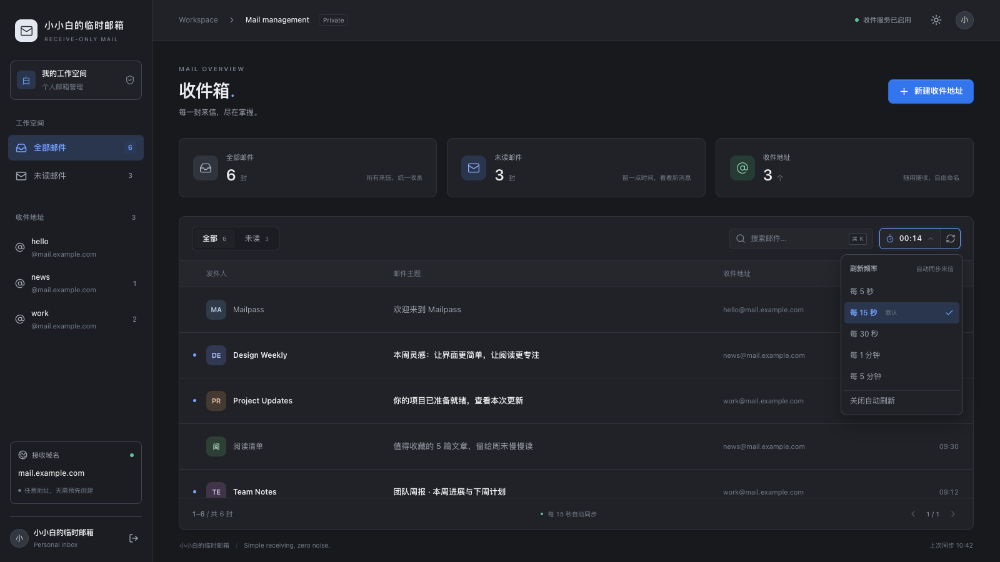

<div align="center">

<h1>Mailpass</h1>
<p><strong>所有地址，一个收件箱。</strong></p>
<p>轻量、私密、只收件的个人临时邮箱。</p>
<p><a href="README.md">English</a> · <a href="#快速开始">快速开始</a> · <a href="https://github.com/1273082756/Mailpass/releases/latest">下载最新版本</a> · <a href="docs/RELEASING.md">发布指南</a></p>

<p>
  <a href="https://github.com/1273082756/Mailpass/releases/latest"></a>
  
  
  
</p>

</div>

配置收件域名后，任意前缀地址都可以直接使用。Mailpass 将所有来信统一收录，支持搜索、按地址筛选与未读管理，邮件持久保存在自己的服务器上。


<p align="center"><a href="img/inbox-desktop.png">浅色原图</a> · <a href="img/inbox-dark.png">深色原图</a></p>

> 截图中的邮件与地址为演示内容。桌面截图均为 1600 × 900（16:9），主图由同一界面的浅色与深色截图斜切拼接。

## 特性

- **地址随用随收**：支持多个域名和任意地址前缀，无需提前创建邮箱。
- **来信集中管理**：搜索发件人、主题或正文，按收件地址、未读状态筛选，支持分页和删除。
- **刷新节奏可控**：倒计时、一键刷新，支持 5 秒 / 15 秒 / 30 秒 / 1 分钟 / 5 分钟或关闭，浏览器自动记住设置。
- **桌面手机都顺手**：分栏与全屏阅读、深浅色模式、可配置站点名称。
- **私密访问**：统一访问密钥，HTML 邮件使用 sandbox iframe 隔离预览。
- **部署依赖少**：SQLite 存储，Docker 数据卷持久化，提供 amd64 / arm64 离线部署包。

仅收件，不提供发信能力。附件只保存名称、类型和大小，暂不支持下载。

## 桌面与移动端

桌面分栏阅读，手机全屏查看同一封来信。点击图片可查看原图。

<table>
  <tr><th width="79%">桌面阅读 · 1600 × 900</th><th width="21%">手机阅读 · 390 × 844</th></tr>
  <tr>
    <td valign="top"><a href="img/reader-desktop.png"></a></td>
    <td valign="top"><a href="img/reader-mobile.png"></a></td>
  </tr>
</table>

<details>
<summary>更多界面：刷新频率、手机收件箱与登录页</summary>

<table>
  <tr><th width="79%">深色模式与刷新频率</th><th width="21%">手机收件箱</th></tr>
  <tr>
    <td valign="top"><a href="img/refresh-settings.png"></a></td>
    <td valign="top"><a href="img/inbox-mobile.png"></a></td>
  </tr>
</table>


</details>

## 快速开始

准备一台安装了 **Docker 和 Docker Compose v2** 的 Linux 服务器，以及可配置 DNS 的收件域名。

### 使用部署包（推荐）

从 [Releases](https://github.com/1273082756/Mailpass/releases/latest) 下载对应架构的部署包和 `.sha256` 校验文件：

| 服务器架构 | 选择的部署包 |
| --- | --- |
| Intel / AMD，`x86_64` / `amd64` | `mailpass-<版本>-linux-amd64.tar.gz` |
| ARM，`aarch64` / `arm64` | `mailpass-<版本>-linux-arm64.tar.gz` |

包内包含前后端镜像，无需安装 Python、Node.js 或从镜像仓库下载。GitHub 自动生成的 **Source code** 是源码包，请选择上表中的部署包。

以 `v1.0.0` 的 amd64 包为例：

```bash
sha256sum -c mailpass-v1.0.0-linux-amd64.tar.gz.sha256
tar -xzf mailpass-v1.0.0-linux-amd64.tar.gz
cd mailpass-v1.0.0-linux-amd64
cp .env.example .env
# 编辑 .env，将 MAIL_DOMAINS 改为你的收件域名
bash start.sh
```

打开 **`http://服务器IP:8080`**。未手动设置 `ACCESS_KEY` 时，从后端日志获取自动生成的访问密钥：

```bash
docker compose logs backend
```

<details>
<summary>从源码构建</summary>

```bash
git clone https://github.com/1273082756/Mailpass.git
cd Mailpass
cp .env.example .env
# 编辑 MAIL_DOMAINS 和其他配置
docker compose up -d --build
```

</details>

### 接收外部邮件

假设收件地址是 `hello@example.com`，SMTP 主机名是 `mail.example.com`：

```text
mail.example.com.  A    <服务器公网 IPv4>
example.com.       MX   10 mail.example.com.
```

将 `MAIL_DOMAINS` 设为 `example.com`，并在云主机安全组、防火墙和面板中开放**入站 TCP 25 端口**。MX 目标需要直接指向 SMTP 主机，不能只配置普通的 HTTP 反向代理。

## 配置

| 变量 | 默认值 | 说明 |
| --- | --- | --- |
| `MAIL_DOMAINS` | 必填 | 接收域名，多个域名用逗号分隔 |
| `SITE_NAME` | `Mailpass` | 界面和浏览器标题中的站点名称 |
| `ACCESS_KEY` | 自动生成 | Web / API 访问密钥 |
| `WEB_PORT` | `8080` | Web 对外端口 |
| `SMTP_PORT` | `25` | SMTP 对外端口，公网收件通常使用 25 |
| `SMTP_ENABLED` | `true` | 是否启用 SMTP 收件 |
| `MAX_MESSAGE_SIZE` | `15728640` | 单封邮件上限，默认 15 MiB |
| `CORS_ORIGINS` | `*` | API 允许的来源 |

Compose 启动需要 `.env`，且 `MAIL_DOMAINS` 不能为空。自动生成的密钥保存在数据卷中的 `/data/.access_key`，重启后复用。不要将 `.env`、密钥或真实邮件数据提交到仓库；公网 Web 访问建议配置 HTTPS。

## 数据与维护

邮件保存在 Docker 数据卷 `mail_data` 中，删除容器后仍会保留。

```bash
docker compose ps          # 查看服务状态
docker compose logs -f     # 查看日志
docker compose down        # 停止服务，保留数据卷
```

升级前备份数据卷，并保留原 `.env`。离线包升级步骤见 [部署说明](deploy/README.md)；自动构建和发布步骤见 [发布指南](docs/RELEASING.md)。`docker compose down --volumes` 会删除数据卷及邮件。

## 本地开发

后端使用 Python 3.11 和 uv。只调试界面时可关闭 SMTP，并将开发数据库放在本地目录：

```bash
cd backend
uv sync
DATABASE_PATH=./tempmail.db SMTP_ENABLED=false uv run uvicorn app.main:app --reload
```

前端使用 React、TypeScript、Vite 和 Bun，在另一个终端运行：

```bash
cd frontend
bun install
bun run dev
```

开发服务器将 `/api` 代理到 `http://127.0.0.1:8000`。运行 `bun run typecheck` 和 `bun run build` 检查前端。后端不会自动加载仓库根目录的 `.env`；需要时为 uvicorn 添加 `--env-file ../.env`。

## 项目结构

```text
backend/                  SMTP 收件、邮件解析、SQLite 与 FastAPI
frontend/                 React + TypeScript 工作台
img/                      桌面、移动端与主题展示图
deploy/                   离线部署模板和启动脚本
scripts/                  打包与部署验证脚本
.github/workflows/        GitHub Actions 发布流程
docs/                     维护与发布文档
docker-compose.yml        从源码构建的服务编排
```

欢迎提交 Issue 和 Pull Request。请保持改动聚焦，并附上简短的验证说明。

## Star 趋势

<a href="https://star-history.com/#1273082756/Mailpass&Date">
  <picture>
    <source media="(prefers-color-scheme: dark)" srcset="https://api.star-history.com/svg?repos=1273082756/Mailpass&amp;type=Date&amp;theme=dark">
    <source media="(prefers-color-scheme: light)" srcset="https://api.star-history.com/svg?repos=1273082756/Mailpass&amp;type=Date">
    
  </picture>
</a>
